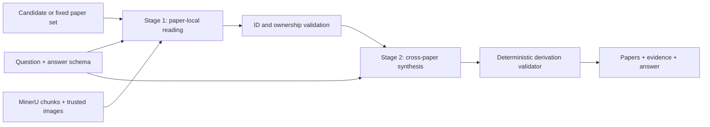

# LitTraceQA科学論文RAG読解系：システム構成と方法

## 1. 概要

本システムは、科学論文に対する質問応答を、論文集合の選定、論文内根拠の抽出、根拠に拘束された回答生成、決定論的検証の4段階へ分解する。検索器と読解器の責任を分離し、読解器は候補論文または外部で確定した論文集合、MinerUで構造化した論文本文・表・図、ならびに質問と回答schemaを入力として受け取る。

読解処理は二段階で構成する。第1段階は各query-paper pairを独立に処理する。候補選別モードでは論文関連性、利用可能な根拠の有無、source chunk IDを判定し、外部選定モードでは固定された各論文から原子事実とsource chunkを抽出する。第2段階は複数論文の検証済み情報を質問単位で統合し、必要な演算、最終回答の各断片、出力用根拠locatorを同時に構成する。LLMは論文の意味読解を担当し、PythonはID所有関係、JSON schema、数値演算、選択肢対応、表構造、画像利用条件、根拠locatorを検査する。

## 2. 問題設定

質問を \(q\)、検索対象論文集合を \(\mathcal{C}\)、選定論文集合を \(\hat{P}\)、根拠集合を \(\hat{E}\)、回答を \(\hat{Y}\) とする。本システムは次の写像を実装する。

\[
\hat{P}=R(q,\mathcal{C}),\qquad
\hat{E}=G(q,\hat{P}),\qquad
\hat{Y}=A(q,\hat{P},\hat{E}).
\]

\(R\) は論文検索・選定、\(G\) は論文内grounding、\(A\) は回答構成である。外部選定モードでは \(R\) の出力を入力として固定し、読解器は \(G\) と \(A\) のみを担当する。候補選別モードでは第1段階が候補論文の関連性判定にも関与する。

システムは最終回答だけでなく、次の追跡可能な鎖を保持する。

```text
question
  -> paper_id
  -> source chunk / attached image
  -> atomic fact
  -> deterministic operation (必要な場合のみ)
  -> answer fragment
  -> evidence locator
```

## 3. 全体アーキテクチャ



主要componentは次の通りである。

1. queryと候補論文sidecarのgold-free loader
2. MinerU本文・表・図・式・引用chunkのstore
3. 質問型に応じたcontext compactionと画像選択
4. 論文単位のStage 1 reader
5. 質問単位のStage 2 answer constructor
6. 原子事実・演算・answer binding validator
7. evidence locator serializer
8. checkpoint、resume、provider attempt ledger

## 4. 入力と信頼境界

### 4.1 Query入力

読解器が利用するquery情報は、質問応答時に公開される次のフィールドに限定する。

- `query_id`
- `benchmark`
- `question`
- `answer_types`
- multiple-choiceの場合の選択肢
- tableの場合の列schema

正解論文、正解根拠、正解回答、開発用task labelはpromptへ渡さない。few-shot selectionと質問routingも、質問文と回答schemaだけから決定する。

### 4.2 論文集合

候補論文はquery本文と分離したsidecarで受け渡す。paper IDを必須とし、rankは明示値または配列順から付与する。title、venue、yearは任意であり、利用可能なpaper metadataから補完できる。loaderは重複paper、欠落query、余分なquery、不連続rank、およびtop-levelの正解・開発専用フィールドを拒否する。

外部選定モードでは、渡されたpaper ID集合をauthoritativeな入力として扱う。読解器はこの集合を追加、削除、再順位付けしない。この構成により、検索器の性能と読解器の性能を独立に分析できる。

### 4.3 論文context

論文本文とmetadataはuntrusted dataとしてdelimiter内に配置する。本文中の命令文はsystem instructionとして解釈しない。chunk ID、paper ID、画像path、page、object IDはPython側で検証し、モデルが生成した未登録IDを採用しない。

## 5. 論文表現とcontext構築

MinerU出力を、次のsource typeへ正規化する。

- title/abstractおよび本文span
- table
- figure
- equation/algorithm
- citation context

各recordはpaper ID、chunk ID、本文を持ち、source typeと抽出状況に応じてpage、section、object ID、画像pathをmetadataとして保持する。長い論文は質問との語彙的一致、source type、caption、object ID、周辺文脈に基づいて決定論的に圧縮する。1つの論文を通常処理で複数のLLM requestへ分割せず、1つのbounded paper contextとしてStage 1へ渡す。

## 6. Stage 1：論文単位読解

### 6.1 候補選別モード

候補選別モードでは、各query-paper pairについて次を予測する。

- `is_relevant_to_answer`
- `has_usable_answer_evidence`
- `evidence_chunk_ids`

論文関連性と、現在のcontextに利用可能な回答根拠が存在するかを別々に判定する。これにより、質問に関係するが抽出contextだけでは回答できない論文を表現できる。Pythonはevidence chunkが対象paper内に実在することを確認し、関連性、利用可能性、有効chunkの3条件を満たすpaperだけをStage 2へ渡す。

質問が特定のFigure、Table、Equation、Referenceと一意な論文titleを明示する場合は、保守的なnamed-owner resolverを用いる。literalかつ文法的に所有関係が一意な場合だけ別所有者を除外し、曖昧なtitle、部分一致、単なる引用先には適用しない。

### 6.2 外部選定モード

外部選定モードではpaper集合を変更せず、各paperから次のevidence factを抽出する。

- `chunk_id`
- `purpose`
- `fact`
- `source_excerpt`

`purpose` はanswer value、comparison operand、eligibility condition、table row、visual fact、citation factなどを表す。text由来のexcerptは指定chunk内に存在しなければならない。Stage 1抽出が不十分な場合は、同一paper内のquery-ranked supplemental chunkをStage 2の再読解contextとして追加できるが、最終evidenceとは区別して記録する。

## 7. Stage 2：質問単位の統合回答

Stage 2は、検証済みの論文contextを質問単位で統合し、次の構造を出力する。

- 回答に使用するpaperと役割
- 原子事実とsource chunk
- 必要な決定論的演算
- 最終回答fragmentへのbinding
- answer object
- evidence support mapping
- completeness情報

原子事実は、`id`、`name`、`value`、`value_kind`、`paper_id`、`chunk_ids` を持つ。単位や限定条件が必要な場合は、原文に対応する形で事実名または値に保持する。計算が必要な質問では、演算のoperandを原子事実へ拘束する。単純なlookupで答えられる質問に不要な演算を追加しない。

対応する演算には、加減乗除、平均、割合変化、count、argmax/argmin、比較、条件に合う選択肢の同定を含む。Pythonは演算結果を再計算し、rounding、label/value対応、入力factとの一致を確認する。

## 8. 回答形式

### 8.1 Multiple-choice

モデルはsemantic answerを決めた後、選択肢labelと完全なoption textを返す。Pythonはlabelが公開選択肢に存在し、labelに対応する実テキストとselected option textが一致することを確認する。option本文は根拠として扱わず、選択に必要な各条件を論文source factへbindingする。

### 8.2 Table

table回答は公開schemaの列名と型に従う。各rowは全列を持ち、row-key tupleは一意でなければならない。列ごとの出力契約は質問とtable schemaだけから構成する。

- `Paper Title` row key：入力metadataのtitleを使用
- その他のrow key：質問中で要求対象を識別する最短の明示labelを使用
- 非row-keyのstring cell：sourceに表示された文字列を保持
- number cell：有限JSON number
- boolean cell：JSON boolean

row identityとnon-key cell valueは別々に扱う。質問が複数settingやmethodを列挙する場合は、各要求unitを個別rowへ対応付ける。原文に存在しない行や値を、表を完成させる目的で補わない。

複数のtable候補を利用する実験では、候補をschema検査した後、各rowとcellをPDF、表画像、または抽出原文へ戻してsource supportを確認できる。実装されたreview/compose gateは、採用可能な変更を `answer.table` に限定し、paper、evidence、multiple-choice、freeform、非table recordを固定する。これは任意の後処理ではなく、source locatorと判断理由を記録するhuman-in-the-loop verificationとして扱う。

## 9. 視覚情報とPDF

画像pathは明示的なimage rootの下へ再配置し、corpusが持つ任意の絶対pathを直接開かない。preflightはpath traversal、root外symlink、破損画像、過大画像、未対応形式を拒否する。

visual queryでは、質問に対応するfigureまたはtable imageが実際にproviderへ添付された場合だけ、画像由来factを採用する。画像が添付されていない状態で、captionや周辺本文だけからpixel、axis、色、配置を断定しない。OCRと画像表示が矛盾する場合は、添付画像をprimary evidenceとして扱い、その選択をtraceへ残す。

PDF fallbackを使用する場合は、取得元、PDF hash、page alignment、render設定、crop範囲を記録する。自動fallbackと対象限定の手動復旧は別の実験条件として扱う。

## 10. 決定論的検証

LLM出力は採用前に次を検証する。

1. JSON schemaと必須field
2. paper/chunk所有関係
3. chunk IDの存在性
4. 必須画像の添付実績
5. fact valueと演算operandの一致
6. 演算結果、比較、count、rounding
7. multiple-choice labelとoption text
8. table列、型、row-key重複
9. answer fragmentとfact/operationのbinding
10. evidence locatorの規定形

検証に失敗した場合は、構造化された失敗理由を付けて修復promptを実行する。修復後も整合しない出力は採用しない。存在しない根拠を推測で補うより、失敗を明示するfail-closed方針を採用する。

## 11. Evidenceの直列化

内部chunk IDは出力用のcoarse locatorへ変換する。

| source type | location | object field |
|---|---|---|
| text span | page、なければsection | なし |
| table | pageまたはsection | `table_id` |
| figure | pageまたはsection | `figure_id` |
| equation/algorithm | page、section、またはobject ID | `equation_id` / `algorithm_id` |
| citation context | page、section、またはcitation ID | `citation_id` |

最終回答を直接支える最小locator集合だけを出力する。Stage 1で読んだchunk、Stage 2へ追加したsupplemental context、最終evidenceを区別し、同じcoarse keyへ写像される重複locatorは除く。

## 12. 質問型ルーティングとPrompt

質問文とanswer schemaから、visual、citation、calculation、otherの主分類と、table、multiple-choice、symbolic expression、percent change、ordinal referenceなどの補助tagを決定する。

few-shotは合成例のみを使用し、実際の評価質問や正解を含めない。質問型に必要な例だけを選び、異なるanswer typeの出力形式を混ぜない。promptは、system policy、合成例、live query、検証済みcontext、出力schemaを明確なdelimiterで分離する。

## 13. 実行・再現性

各runのmanifestは、次を保存する。

- query、candidate、paper metadata、reader configのhash
- runtime source fileのhash
- model deploymentとAPI version
- token上限とevidence上限
- image rootとchunk index
- paper-set policy

Stage 1のpaper judgmentとStage 2 answerをquery単位でcheckpointし、prompt versionとfew-shot IDを各checkpointおよびcache keyへ記録する。provider callごとにprepare/finalize event、request ID、token usage、error outcomeをledgerへ記録する。resume時はinput、config、runtime hashを照合し、currentなcheckpointだけを再利用する。

## 14. 計算量と実行特性

候補選別モードで質問 \(q_i\) に \(n_i\) 本の候補論文がある場合、通常のStage 1 call数は \(\sum_i n_i\)、Stage 2 call数は質問数である。named-owner resolverによる決定論的除外はStage 1 callを削減する。外部選定モードでもpaperごとの抽出を並列化し、質問内の統合はStage 2で1回行う。

長文contextと画像を含むため、worker数だけでなくtoken-per-minuteを考慮したglobal launch pacerを用いる。429 responseを受けた場合は、該当jobだけを再queueし、shared concurrencyを減少させる。成功windowでは上限まで段階的に回復させる。

## 15. Ablation

各componentの寄与は、次のablationで評価できる。

- 候補選別モードと外部選定モード
- 質問型routingあり／なし
- 合成few-shotあり／なし
- text-onlyとvisual inputあり
- deterministic derivation validatorあり／なし
- supplemental contextあり／なし
- query-aware locator recoveryあり／なし
- raw table generationとsource-verified table selection
- automatic outputとhuman-assisted verification

paper selection、evidence grounding、answer correctness、invalid output率、provider call数、token usageを別々に報告する。

## 16. 制約

1. OCR誤りや欠落figureは、正しい論文が選定されても回答を阻害する。
2. 複数の同義な根拠位置がある場合、最小locatorの選択は一意でない。
3. 表のrow keyとstring cellは表面形に敏感であり、意味的同値性だけでは一致しない。
4. 固定論文集合に必要なownerが含まれない場合、読解器だけではpaper recallを回復できない。
5. human-in-the-loop verificationは科学的整合性を高めるが、完全自動条件とは直接比較できない。
6. PDF fallbackと画像cropの再現には、取得元と変換manifestが必要である。

## 17. 実験条件の報告

論文では、少なくとも次を明示する。

- retrieval/paper selectionの方法
- pairwiseまたはfixed-selectedのpaper-set policy
- model、prompt version、few-shot policy
- text、image、PDF fallbackの使用範囲
- deterministic validatorの有無
- automatic、source-audited、human-assistedのどの条件か
- 外部resourceと手動操作
- run manifestと出力hash

humanによるsource adjudication、PDF復旧、表面形の手動修正を用いた結果は、完全自動readerの結果と分けて報告する。これはシステムの能力境界と再現性を明確にするためである。

## 18. 論文Method節用短縮版

> 我々は、科学論文QAを論文選定、論文内grounding、回答構成、決定論的検証に分解した二段階RAG readerを構築した。第1段階は各query-paper pairを独立に処理し、候補選別モードでは論文関連性と利用可能な回答根拠を分離して判定し、外部選定モードでは固定paper集合から原子事実とsource chunkを抽出する。第2段階は検証済みchunkを質問単位で統合し、原子事実、必要な演算、最終回答fragmentへのbinding、evidence supportを含む構造化回答を生成する。Python validatorはpaper/chunk所有関係、画像添付、演算、選択肢対応、table schema・型・row key、ならびにcoarse evidence locatorを検査する。
>
> Prompt routingは質問文とanswer schemaだけから決定し、visual、citation、calculation、otherの主分類とanswer-type別の合成few-shotを用いる。論文本文、表、図、式、引用はMinerU recordとして統一的に読み、visual factは実際に添付された画像からのみ採用する。表回答ではrow identityとnon-key valueを分離し、質問中の明示labelとsource上のcell表面形を列別契約に従って直列化する。すべての回答はsource factから、必要な場合はoperationを介して、answer fragmentとevidence locatorまで追跡可能にした。

## 19. 実装対応

| Component | Main implementation |
|---|---|
| query/candidate loading | `src/littraceqa/candidate_handoff.py` |
| Stage 1 / Stage 2 reader | `src/littraceqa/aoai_pairwise_reader.py` |
| prompt routing and examples | `src/littraceqa/pairwise_prompts.py` |
| derivation validation | `src/littraceqa/answer_derivation.py` |
| MinerU normalization | `src/littraceqa/mineru_record.py` |
| visual preflight | `src/littraceqa/corpus_preflight.py` |
| evidence locator | `src/littraceqa/citation_locator.py` |
| run orchestration | `scripts/run_aoai_pairwise_reader.py` |
| checkpoint ledger | `src/littraceqa/pairwise_run_store.py` |
| table output contract | `src/littraceqa/query_requirements.py` |
| source-reviewed table composition | `src/littraceqa/table_adjudication.py` |
